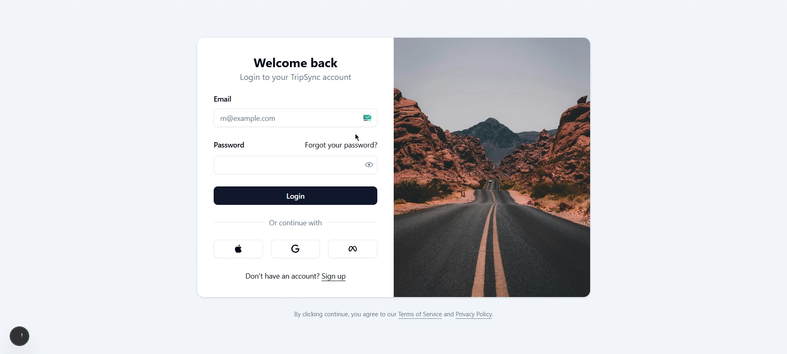
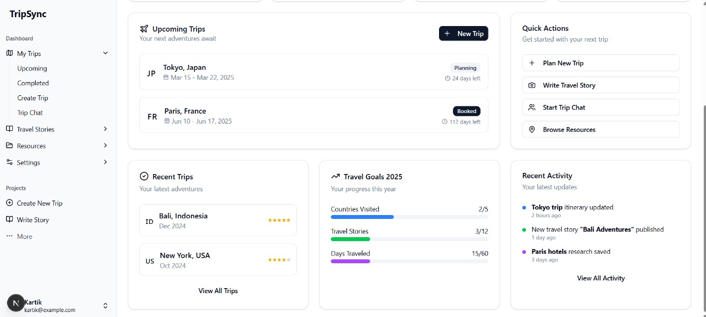
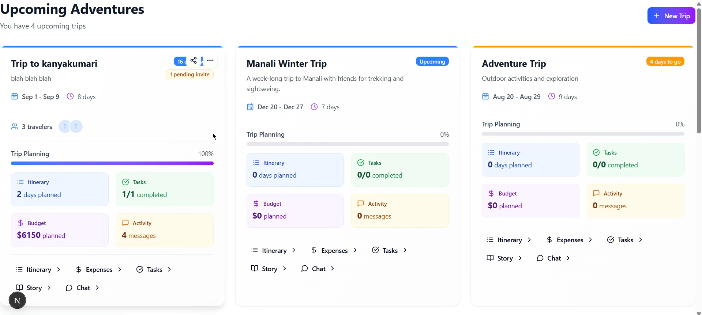
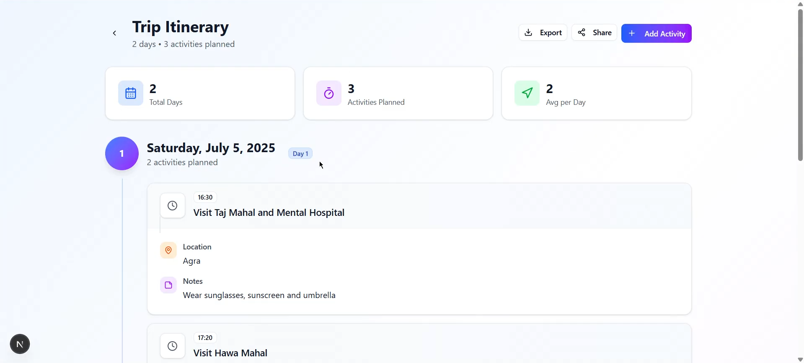
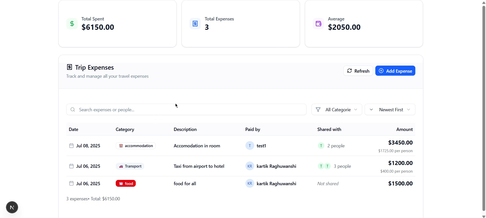
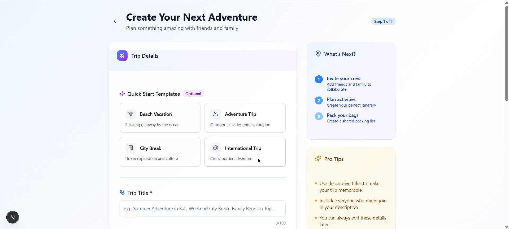

# 🌍 TripSync

TripSync is a collaborative platform for **trip planning** and **story writing**, designed to make travel coordination seamless and fun.  
Plan your itinerary, share resources, and document your journey — all in one place.

⚠️ **Note:** This project is currently **under development** and not deployed yet. Stay tuned for updates!

---

## ✨ Features

- 📝 **Trip Planning** – Create and manage detailed itineraries.  
- 📂 **Resource Sharing** – Store and share important travel resources.  
- 📖 **Travel Stories** – Write and share stories about your trips.  
- 💰 **Expense Tracking** – Split and manage expenses across the group.
- 👥 **Collaborator Management** – Invite collaborators to your trip and allocate roles.
- ✅ **Task Management** – Create tasks, set priorities, and assign them to collaborators.
- 
---

## 🚀 Upcoming Features

- 📊 **User Dashboard** – Personalized dashboard to track trips and stories.  
- 🤝 **Real-time Collaboration** – Collaborative editing and **group chat** for seamless coordination.  
- ⚡ **Scalable Backend** – Optimized with Redis and BullMQ for handling live updates (planned).  

---

## 🛠️ Tech Stack

- **Frontend:** TypeScript, Next.js, shadcn/ui, Tailwind CSS  
- **Backend:** Node.js, ExpressJs, MongoDB  
- **Realtime:** Socket.io  
- **Other Tools:** Vercel (for deployment), Git & GitHub (version control)  

---

## 🏗️ Project Architecture

```
                 ┌────────────────────┐
                 │      Frontend      │
                 │  Next.js + TS +    │
                 │  shadcn/ui + Tailwind │
                 └─────────┬──────────┘
                           │
                           ▼
                 ┌────────────────────┐
                 │      Backend       │
                 │  Node.js + MongoDB │
                 └─────────┬──────────┘
                           │
                           ▼
                 ┌────────────────────┐
                 │   Real-time Layer  │
                 │     Socket.io      │
                 └─────────┬──────────┘
                           │
                           ▼
                 ┌────────────────────┐
                 │   Future Scaling   │
                 │ Redis + BullMQ     │
                 └────────────────────┘
```

---

## 📦 Getting Started

Follow these steps to run TripSync locally:

### 1. Clone the repo
```bash
git clone https://github.com/raghukartik/TripSync.git
cd tripsync
```

### 2. Install dependencies
```bash
cd backend
npm install

cd ../frontend
npm install
```

### 3. Setup environment variables
Create a `.env` file in the backend folder and add:
```
MONGODB_URI=your_mongodb_connection_string
ACCESS_TOKEN_SECRET=your JWT secret.
CLIENT_URL=your_frontend_url
```

### 4. Run the backend server
```bash
cd backend
npm start
Backend runs on http://localhost:8000
```

### 5. Run the frontend server
```bash
cd frontend
npm run dev
```

---

## 📸 Screenshots









---

## 🤝 Contributing

Contributions, issues, and feature requests are welcome!  
Feel free to open a pull request or start a discussion in the [issues](https://github.com/your-username/tripsync/issues).

---

## 👤 Author

- **Kartik Raghuwanshi**  
  💼 [LinkedIn](https://www.linkedin.com/in/kartik-raghuwanshi-5a2b83267/)  
  🐙 [GitHub](https://github.com/raghukartik)  
